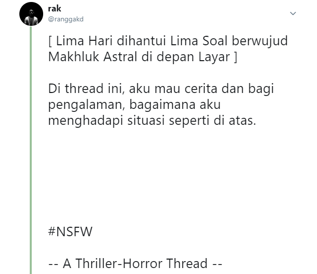

# SoalShift_modul3_F03
Keperluan tugas laboratorium Sistem Operasi 2019

<center>



</center>

---

## NO 1

Buatlah program C yang bisa menghitung faktorial secara parallel lalu menampilkan hasilnya secara berurutan  
Contoh:  
	./faktorial 5 3 4  
	3! = 6  
	4! = 24  
	5! = 120

**Jawaban**

1. Buat program dibawah ini dengan nama file soal1.c di folder yang ditentukan.

```c
#include <stdio.h>
#include <unistd.h>
#include <pthread.h>
#include <stdlib.h>
#define llu unsigned long long

pthread_t tid[50];
llu result[50] = {0};

void* fact_dp(void* arv);

int main(int argc, char* argv[])
{
    //invalid cmd argument
    if (argc <2)
    {
        printf("minimal satu argumen\n");
        exit(1);
    }
    //processing factorial by threading
    int flag[50] = {0};
    int c=0;
    int* arg=malloc(sizeof(int*));
    while(argc>1)
    {
        *arg=(atoi(argv[c+1]));
        pthread_create(&tid[c],NULL,fact_dp,(void*)arg);
        flag[*arg]=1;
        argc--;
        c++;
        pthread_join(tid[c-1],NULL);
        //join until any thread eliminate
    }
    int l=0;
    //display the output from array sort asc
    while(l<50)
    {
        if (flag[l] != 0)
            printf("%d! = %llu\n",l,result[l]);
        l++;
    }
    return 0;
}

void* fact_dp(void* arv)
{
    int *n = (int*)arv;
    // printf("n=%d\n",*n);
    if (*n >= 0) 
    {
        if (result[*n] != 0)
            return NULL;
        else
        {
            result[0] = 1;
            for (int i = 1; i <= *n; ++i) 
                result[i] = i * result[i - 1];
            return NULL;
        }
    }
}
```
Penjelasan:
```c
void* fact_dp(void* arv)
{
    int *n = (int*)arv;
    // printf("n=%d\n",*n);
    if (*n >= 0) 
    {
        if (result[*n] != 0)
            return NULL;
        else
        {
            result[0] = 1;
            for (int i = 1; i <= *n; ++i) 
                result[i] = i * result[i - 1];
            return NULL;
        }
    }
}
```
Fungsi untuk mencari bilangan factorial dari argumen tipe data arv yang akan di type cast menjadi pointer integer dengan konsep pemrograman dinamis.
```c
//invalid cmd argument
if (argc <2)
{
    printf("minimal satu argumen\n");
    exit(1);
}
```
invalid handling argumen command line yang membutuhkan minimal satu argumen
```c
//processing factorial by threading
int flag[50] = {0};
int c=0;
int* arg=malloc(sizeof(int*));
while(argc>1)
{
    *arg=(atoi(argv[c+1]));
    pthread_create(&tid[c],NULL,fact_dp,(void*)arg);
    flag[*arg]=1;
    argc--;
    c++;
    pthread_join(tid[c-1],NULL);
    //join until any thread eliminate
}
```
Array integer flag guna menandai bilangan apa saja yang telah dipassing sebagai argumen ke program. While loop berguna untuk melakukan threading program menghitung nilai factorial suatu argumen kemudian dilanjutkan dengan menunggu threading itu mati.
```c
int l=0;
//display the output from array sort asc
while(l<50)
{
    if (flag[l] != 0)
        printf("%d! = %llu\n",l,result[l]);
    l++;
}
return 0;
```
While loop untuk menampilkan hasil output sesuai soal berdasarkan tanda array flag.

2. Lalu compile file tadi dengan `-pthread` dan jalankan di terminal

3. Lakukan simulasi test. Hasil akhir bisa dicek di terminal.

---

## NO 2

Pada suatu hari ada orang yang ingin berjualan 1 jenis barang secara private, dia memintamu membuat program C dengan spesifikasi sebagai berikut:  
1. Terdapat 2 server: server penjual dan server pembeli
2.	1 server hanya bisa terkoneksi dengan 1 client
3.	Server penjual dan server pembeli memiliki stok barang yang selalu sama
4.	Client yang terkoneksi ke server penjual hanya bisa menambah stok
    - Cara menambah stok: client yang terkoneksi ke server penjual mengirim string “tambah” ke server lalu stok bertambah 1
5.	Client yang terkoneksi ke server pembeli hanya bisa mengurangi stok
    - Cara mengurangi stok: client yang terkoneksi ke server pembeli mengirim string “beli” ke server lalu stok berkurang 1
6.	Server pembeli akan mengirimkan info ke client yang terhubung dengannya apakah transaksi berhasil atau tidak berdasarkan ketersediaan stok
    -	Jika stok habis maka client yang terkoneksi ke server pembeli akan mencetak “transaksi gagal”
    -	Jika stok masih ada maka client yang terkoneksi ke server pembeli akan mencetak “transaksi berhasil”
7.	Server penjual akan mencetak stok saat ini setiap 5 detik sekali
8.	Menggunakan thread, socket, shared memory

**Jawaban**

1. Buat program dibawah ini dengan nama file soal2.c di folder yang ditentukan.

```c
    //code
```
Penjelasan:
```c
    //code
```
//penjelasan
```c
    //code
```
//penjelasan
```c
    //code
```
//penjelasan

2. Lalu compile file tadi dengan `-pthread` dan jalankan di terminal

3. Lakukan simulasi test dengan membuka multi-terminal.

---

## NO 3

Agmal dan Iraj merupakan 2 sahabat yang sedang kuliah dan hidup satu kostan, sayangnya mereka mempunyai gaya hidup yang berkebalikan, dimana Iraj merupakan laki-laki yang sangat sehat,rajin berolahraga dan bangun tidak pernah kesiangan sedangkan Agmal hampir menghabiskan setengah umur hidupnya hanya untuk tidur dan ‘ngoding’. Dikarenakan mereka sahabat yang baik, Agmal dan iraj sama-sama ingin membuat satu sama lain mengikuti gaya hidup mereka dengan cara membuat Iraj sering tidur seperti Agmal, atau membuat Agmal selalu bangun pagi seperti Iraj. Buatlah suatu program C untuk menggambarkan kehidupan mereka dengan spesifikasi sebagai berikut:
1.	Terdapat 2 karakter Agmal dan Iraj
2.	Kedua karakter memiliki status yang unik
    - Agmal mempunyai WakeUp_Status, di awal program memiliki status 0
    - Iraj memiliki Spirit_Status, di awal program memiliki status 100
    - Terdapat 3 Fitur utama  
        ● All Status, yaitu menampilkan status kedua sahabat  
            Ex: Agmal WakeUp_Status = 75  
                Iraj Spirit_Status = 30  
        ● “Agmal Ayo Bangun” menambah WakeUp_Status Agmal sebesar 15 point  
        ● “Iraj Ayo Tidur” mengurangi Spirit_Status Iraj sebanyak 20 point
    - Terdapat Kasus yang unik dimana:  
        ● Jika Fitur “Agmal Ayo Bangun” dijalankan sebanyak 3 kali, maka Fitur “Iraj Ayo Tidur” Tidak bisa dijalankan selama 10 detik (Dengan mengirim pesan ke sistem “Fitur Iraj Ayo Tidur disabled 10 s”)  
        ● Jika Fitur  “Iraj Ayo Tidur” dijalankan sebanyak 3 kali, maka Fitur “Agmal Ayo Bangun” Tidak bisa dijalankan selama 10 detik (Dengan mengirim pesan ke sistem “Agmal Ayo Bangun disabled 10 s”)
    - Program akan berhenti jika Salah Satu :  
        ● WakeUp_Status Agmal >= 100 (Tampilkan Pesan “Agmal Terbangun,mereka bangun pagi dan berolahraga”)  
        ● Spirit_Status Iraj <= 0 (Tampilkan Pesan “Iraj ikut tidur, dan bangun kesiangan bersama Agmal”)
    - Syarat Menggunakan Lebih dari 1 Thread

**Jawaban**

1. Buat program dibawah ini dengan nama file soal3.c di folder yang ditentukan.

```c
#include <stdio.h>
#include <unistd.h>
#include <pthread.h>
#include <stdlib.h>
#include <termios.h>

pthread_t tid[4];

//status
int* WakeUp_Status;  
int* Spirit_Status; 
int* timerWUS;
int* timerSS;

//variabel pembuat disabled
int cAAB;
int cIAT;

//fungsi tuk thread
void* tWUS(void* arv);
void* tSS(void* arv);
void* tDisabledWUS(void* arv);
void* tDisabledSS(void* arv);

//fungsi non thread
char allStatusMode();
char menuMode();
/* reads from keypress, doesn't echo */
int getch(void);

int main()
{
    //alokasi argumen
    WakeUp_Status=malloc(sizeof(int*));  
    Spirit_Status=malloc(sizeof(int*)); 
    timerWUS=malloc(sizeof(int*));
    timerSS=malloc(sizeof(int*));
    *WakeUp_Status=0;
    *Spirit_Status=100;
    *timerWUS=10;
    *timerSS=10;
    cAAB=cIAT=1;
    //threading
    pthread_create(&tid[0],NULL,tWUS,(void*)WakeUp_Status);
    pthread_create(&tid[1],NULL,tSS,(void*)Spirit_Status);
    pthread_create(&tid[2],NULL,tDisabledWUS,(void*)timerWUS);
    pthread_create(&tid[3],NULL,tDisabledSS,(void*)timerSS);
    //main program
    char menu='2';
    while(1)
    {
        if (menu=='1')
            menu=allStatusMode();
        else if (menu=='2')
            menu=menuMode();
    }
    return 0;
}

int getch(void)
{
    struct termios oldattr, newattr;
    int ch;
    tcgetattr( STDIN_FILENO, &oldattr );
    newattr = oldattr;
    newattr.c_lflag &= ~( ICANON | ECHO );
    tcsetattr( STDIN_FILENO, TCSANOW, &newattr );
    ch = getchar();
    tcsetattr( STDIN_FILENO, TCSANOW, &oldattr );
    return ch;
}
void* tWUS(void* arv)
{
    int* w = (int*)arv;
    while(1)
    {
        if (*w >= 100)
        {
            system("clear");
            printf("Agmal Terbangun,mereka bangun pagi dan berolahraga\n");
            exit(1);
        }
    }  
}
void* tSS(void* arv)
{
    int* s = (int*)arv;
    while(1)
    {
        if (*s <= 0)
        {
            system("clear");
            printf("Iraj ikut tidur, dan bangun kesiangan bersama Agmal\n");
            exit(2);
        }
    }
}
void* tDisabledWUS(void* arv)
{   //disabled AAB
    int* disw = (int*)arv;
    int f;
    while(1)
    {
        if (cIAT % 4 == 0)
        {
            f=cIAT;
            while(*disw>=1)
            {
                *disw-=1;
                sleep(1);
            }
        }
        if (*disw == 0)
        {
            //kalo sequence ditunggu BBB nunggu baru milih
            if (f==cIAT)
                cIAT=1;
            //kalo gak ditunggu BBBAB langsung
            *disw=10;
        }
    }
}
void* tDisabledSS(void* arv)
{   //disabled IAT
    int* diss = (int*)arv;
    int f;
    while(1)
    {
        if (cAAB % 4 == 0)
        {
            f=cAAB;
            while(*diss>=1)
            {
                *diss-=1;
                sleep(1);
            }
        }
        if (*diss == 0)
        {
            //kalo sequence ditunggu AAA nunggu baru milih
            if (f==cAAB)
                cAAB=1;
            //kalo gak ditunggu AAABA langsung
            *diss=10;
        }
    }
}
char menuMode()
{
    while(1)
    {
        system("clear");
        printf("Menu Mode\n");
        printf("1. All Status\n2. Agmal Ayo Bangun\n3. Iraj Ayo Tidur\n");
        //cek pengaksesan fitur AAB
        if (*timerWUS != 10)  printf("Agmal Ayo Bangun disabled %d s\n",*timerWUS);
        //cek pengaksesan fitur IAT
        if (*timerSS != 10)  printf("Fitur Iraj Ayo Tidur disabled %d s\n",*timerSS);
        char c;
        c=getch();
        if (c=='1')
            return c;
        else if (c=='2')
        {
            if (cIAT % 4 != 0 && *timerWUS == 10)
            {
                *WakeUp_Status+=15;
                cAAB=cAAB+1;
            }
        }
        else if (c=='3')
        {
            if (cAAB % 4 != 0 && *timerSS == 10)
            {
                *Spirit_Status-=20;
                cIAT=cIAT+1;
            }
        }
        else
            continue;
    } 
}
char allStatusMode()
{
    while(1)
    {
        system("clear");
        printf("All Status Mode\n");
        printf("Agmal\tWakeUp_Status = %d\n",*WakeUp_Status);
        printf("Iraj\tSpirit_Status = %d\n",*Spirit_Status);
        printf("Choices\n");
        printf("1. Menu\n");
        char c;
        c=getch();
        if (c=='1') return '2';
    }
}
```
Penjelasan:
```c
#include <stdio.h>
#include <unistd.h>
#include <pthread.h>
#include <stdlib.h>
#include <termios.h>

pthread_t tid[4];

//status
int* WakeUp_Status;  
int* Spirit_Status; 
int* timerWUS;
int* timerSS;

//variabel pembuat disabled
int cAAB;
int cIAT;

//fungsi tuk thread
void* tWUS(void* arv);
void* tSS(void* arv);
void* tDisabledWUS(void* arv);
void* tDisabledSS(void* arv);

//fungsi non thread
char allStatusMode();
char menuMode();
/* reads from keypress, doesn't echo */
int getch(void);
```
Variabel global untuk status dan timer yang digunakan untuk menentukan tingkah laku fitur yang dimaksud soal. Variabel pembuat disabled berguna sebagai counter berapa kali fitur digunakan. Fungsi untuk thread ditujukan untuk melakukan pengecekan terus-menerus terhadap perubahan nilai. Fungsi non thread digunakan untuk display fitur dan agar mudah di dokumentasikan. Fungsi getch sebagai tambahan fitur key press detection.
```c
int main()
{
    //alokasi argumen
    WakeUp_Status=malloc(sizeof(int*));  
    Spirit_Status=malloc(sizeof(int*)); 
    timerWUS=malloc(sizeof(int*));
    timerSS=malloc(sizeof(int*));
    *WakeUp_Status=0;
    *Spirit_Status=100;
    *timerWUS=10;
    *timerSS=10;
    cAAB=cIAT=1;
    //threading
    pthread_create(&tid[0],NULL,tWUS,(void*)WakeUp_Status);
    pthread_create(&tid[1],NULL,tSS,(void*)Spirit_Status);
    pthread_create(&tid[2],NULL,tDisabledWUS,(void*)timerWUS);
    pthread_create(&tid[3],NULL,tDisabledSS,(void*)timerSS);
    //main program
    char menu='2';
    while(1)
    {
        if (menu=='1')
            menu=allStatusMode();
        else if (menu=='2')
            menu=menuMode();
    }
    return 0;
}
```
Awalnya mengalokasikan memori yang sesuai dengan tipe data. Lalu menginisialisasi nilai awal sesuai soal. Lalu lakukan threading dengan argumen yang sesuai. Main program melakukan switch dari allStatus mode ke Menu Mode ataupun sebaliknya.
```c
int getch(void)
{
    struct termios oldattr, newattr;
    int ch;
    tcgetattr( STDIN_FILENO, &oldattr );
    newattr = oldattr;
    newattr.c_lflag &= ~( ICANON | ECHO );
    tcsetattr( STDIN_FILENO, TCSANOW, &newattr );
    ch = getchar();
    tcsetattr( STDIN_FILENO, TCSANOW, &oldattr );
    return ch;
}
```
Implementasi key press di C pada OS Linux (stackoverflow.com)
```c
void* tWUS(void* arv)
{
    int* w = (int*)arv;
    while(1)
    {
        if (*w >= 100)
        {
            system("clear");
            printf("Agmal Terbangun,mereka bangun pagi dan berolahraga\n");
            exit(1);
        }
    }  
}
void* tSS(void* arv)
{
    int* s = (int*)arv;
    while(1)
    {
        if (*s <= 0)
        {
            system("clear");
            printf("Iraj ikut tidur, dan bangun kesiangan bersama Agmal\n");
            exit(2);
        }
    }
}
```
Fungsi tWUS untuk melakukan cek fitur Agmal Ayo Bangun jika dapat keluar program. Fungsi tSS untuk melakukan cek fitur Iraj Ayo Tidur jika dapat keluar dari program.
```c
void* tDisabledWUS(void* arv)
{   //disabled AAB
    int* disw = (int*)arv;
    int f;
    while(1)
    {
        if (cIAT % 4 == 0)
        {
            f=cIAT;
            while(*disw>=1)
            {
                *disw-=1;
                sleep(1);
            }
        }
        if (*disw == 0)
        {
            //kalo sequence ditunggu BBB nunggu baru milih
            if (f==cIAT)
                cIAT=1;
            //kalo gak ditunggu BBBAB langsung
            *disw=10;
        }
    }
}
void* tDisabledSS(void* arv)
{   //disabled IAT
    int* diss = (int*)arv;
    int f;
    while(1)
    {
        if (cAAB % 4 == 0)
        {
            f=cAAB;
            while(*diss>=1)
            {
                *diss-=1;
                sleep(1);
            }
        }
        if (*diss == 0)
        {
            //kalo sequence ditunggu AAA nunggu baru milih
            if (f==cAAB)
                cAAB=1;
            //kalo gak ditunggu AAABA langsung
            *diss=10;
        }
    }
}
```
Fungsi tDisabledWUS atau tDisabledSS digunakan untuk mengecek disabled fitur AAB atau IAT terkait berdasarkan argumen timerWUS atau timerSS yang diterima.
```c
char menuMode()
{
    while(1)
    {
        system("clear");
        printf("Menu Mode\n");
        printf("1. All Status\n2. Agmal Ayo Bangun\n3. Iraj Ayo Tidur\n");
        //cek pengaksesan fitur AAB
        if (*timerWUS != 10)  printf("Agmal Ayo Bangun disabled %d s\n",*timerWUS);
        //cek pengaksesan fitur IAT
        if (*timerSS != 10)  printf("Fitur Iraj Ayo Tidur disabled %d s\n",*timerSS);
        char c;
        c=getch();
        if (c=='1')
            return c;
        else if (c=='2')
        {
            if (cIAT % 4 != 0 && *timerWUS == 10)
            {
                *WakeUp_Status+=15;
                cAAB=cAAB+1;
            }
        }
        else if (c=='3')
        {
            if (cAAB % 4 != 0 && *timerSS == 10)
            {
                *Spirit_Status-=20;
                cIAT=cIAT+1;
            }
        }
        else
            continue;
    } 
}
char allStatusMode()
{
    while(1)
    {
        system("clear");
        printf("All Status Mode\n");
        printf("Agmal\tWakeUp_Status = %d\n",*WakeUp_Status);
        printf("Iraj\tSpirit_Status = %d\n",*Spirit_Status);
        printf("Choices\n");
        printf("1. Menu\n");
        char c;
        c=getch();
        if (c=='1') return '2';
    }
}
```
Fungsi menyajikan display yang diminta oleh soal dan syarat fitur berjalan.

2. Lalu compile file tadi dengan `-pthread` dan jalankan di terminal

3. Lakukan simulasi test dengan semua fitur mode yang ada.

---

## NO 4

Buatlah sebuah program C dimana dapat menyimpan list proses yang sedang berjalan (ps -aux) maksimal 10 list proses. Dimana awalnya list proses disimpan dalam di 2 file ekstensi .txt yaitu  SimpanProses1.txt di direktori /home/Document/FolderProses1 dan SimpanProses2.txt di direktori /home/Document/FolderProses2 , setelah itu masing2 file di  kompres zip dengan format nama file KompresProses1.zip dan KompresProses2.zip dan file SimpanProses1.txt dan SimpanProses2.txt akan otomatis terhapus, setelah itu program akan menunggu selama 15 detik lalu program akan mengekstrak kembali file KompresProses1.zip dan KompresProses2.zip  
Dengan Syarat :
- Setiap list proses yang di simpan dalam masing-masing file .txt harus berjalan bersama-sama
- Ketika mengkompres masing-masing file .txt harus berjalan bersama-sama
- Ketika Mengekstrak file .zip juga harus secara bersama-sama
- Ketika Telah Selesai melakukan kompress file .zip masing-masing file, maka program akan memberi pesan “Menunggu 15 detik untuk mengekstrak kembali”
- Wajib Menggunakan Multithreading
- Boleh menggunakan system

**Jawaban**

1. Buat program dibawah ini dengan nama file soal4.c di folder yang ditentukan.

```c
#include <stdio.h>
#include <unistd.h>
#include <pthread.h>
#include <stdlib.h>
#include <string.h>

pthread_t tid[2];

//fungsi thread
void* tProses(void* arv);
void* tZip(void* arv);
void* tRemove(void* arv);
void* tUnzip(void* arv);

int main()
{
    char p1[]={"~/Document/FolderProses1/SimpanProses1.txt"};
    char p2[]={"~/Document/FolderProses2/SimpanProses2.txt"};
    //melakukan saving file
    pthread_create(&tid[0],NULL,tProses,(void*)p1);
    pthread_create(&tid[1],NULL,tProses,(void*)p2);
    //melakukan kompress file ke zip
    pthread_join(tid[0],NULL);
    pthread_join(tid[1],NULL);
    pthread_create(&tid[0],NULL,tZip,(void*)p1);
    pthread_create(&tid[1],NULL,tZip,(void*)p2);
    //melakukan remove file txt
    pthread_join(tid[0],NULL);
    pthread_join(tid[1],NULL);
    pthread_create(&tid[0],NULL,tRemove,(void*)p1);
    pthread_create(&tid[1],NULL,tRemove,(void*)p2);
    //melakukan dekompress zip
    pthread_join(tid[0],NULL);
    pthread_join(tid[1],NULL);
    pthread_create(&tid[0],NULL,tUnzip,NULL);
    pthread_create(&tid[1],NULL,tUnzip,NULL);
    pthread_join(tid[0],NULL);
    pthread_join(tid[1],NULL);
    return 0;
}

void* tProses(void* arv)
{
    char in[200]={"ps -aux | head -n 11 > "};
    strcat(in,(char*)arv);
    printf("%s\n",in);
    system(in);
    return NULL;
}
void* tZip(void* arv)
{
    char in[200]={"zip ~/Document/FolderProses"};
    //jika tid yang pertama
    if (pthread_equal(pthread_self(),tid[0]))
        strcat(in,"1/KompresProses1.zip -j ");
    //jika tid yang kedua
    else if (pthread_equal(pthread_self(),tid[1]))
        strcat(in,"2/KompresProses2.zip -j ");
    strcat(in,(char*)arv);
    printf("%s\n",in);
    system(in);
    return NULL;
}
void* tRemove(void* arv)
{
    char in[200]={"rm "};
    strcat(in,(char*)arv);
    printf("%s\n",in);
    system(in);
    //menunggu selama 15 detik
    printf("Menunggu 15 detik untuk mengekstrak kembali\n");
    sleep(15);
    return NULL;
}
void* tUnzip(void* arv)
{
    char in[200]={"unzip "};
    //jika tid yang pertama
    if (pthread_equal(pthread_self(),tid[0]))
        strcat(in,"~/Document/FolderProses1/KompresProses1.zip -d ~/Document/FolderProses1/");
    //jika tid yang kedua
    else if (pthread_equal(pthread_self(),tid[1]))
        strcat(in,"~/Document/FolderProses2/KompresProses2.zip -d ~/Document/FolderProses2/");
    printf("%s\n",in);
    system(in);
    return NULL;
}
```
Penjelasan:
```c
#include <stdio.h>
#include <unistd.h>
#include <pthread.h>
#include <stdlib.h>
#include <string.h>

pthread_t tid[2];

//fungsi thread
void* tProses(void* arv);
void* tZip(void* arv);
void* tRemove(void* arv);
void* tUnzip(void* arv);
```
Alokasi array dari thread untuk penggunaan 2 thread. Prototipe fungsi untuk dilakukan oleh thread nantinya sesuai dengan langkah yang terkandung dalam nama variabel.
```c
int main()
{
    char p1[]={"~/Document/FolderProses1/SimpanProses1.txt"};
    char p2[]={"~/Document/FolderProses2/SimpanProses2.txt"};
    //melakukan saving file
    pthread_create(&tid[0],NULL,tProses,(void*)p1);
    pthread_create(&tid[1],NULL,tProses,(void*)p2);
    //melakukan kompress file ke zip
    pthread_join(tid[0],NULL);
    pthread_join(tid[1],NULL);
    pthread_create(&tid[0],NULL,tZip,(void*)p1);
    pthread_create(&tid[1],NULL,tZip,(void*)p2);
    //melakukan remove file txt
    pthread_join(tid[0],NULL);
    pthread_join(tid[1],NULL);
    pthread_create(&tid[0],NULL,tRemove,(void*)p1);
    pthread_create(&tid[1],NULL,tRemove,(void*)p2);
    //melakukan dekompress zip
    pthread_join(tid[0],NULL);
    pthread_join(tid[1],NULL);
    pthread_create(&tid[0],NULL,tUnzip,NULL);
    pthread_create(&tid[1],NULL,tUnzip,NULL);
    pthread_join(tid[0],NULL);
    pthread_join(tid[1],NULL);
    return 0;
}
```
Main program menginisialisasi string berisi lokasi file yang nantinya dieksekusi oleh thread. Proses awal melakukan saving file dengan fungsi tProses, lalu melakukan kompress file dengan fungsi tZip yang sebelumnya dilakukan join untuk menunggu thread sebelumnya selesai. Lalu remove file dengan fungsi tRemove yang sebelumnya dilakukan join untuk menunggu thread sebelumnya selesai, lalu unzip file dengan fungsi tUnzip tanpa argumen yang sebelumnya dilakukan join untuk menunggu thread sebelumnya selesai.
```c
void* tProses(void* arv)
{
    char in[200]={"ps -aux | head -n 11 > "};
    strcat(in,(char*)arv);
    printf("%s\n",in);
    system(in);
    return NULL;
}
void* tRemove(void* arv)
{
    char in[200]={"rm "};
    strcat(in,(char*)arv);
    printf("%s\n",in);
    system(in);
    //menunggu selama 15 detik
    printf("Menunggu 15 detik untuk mengekstrak kembali\n");
    sleep(15);
    return NULL;
}
```
Fungsi tProses dan tRemove menggunakan system untuk mengeksekusi perintah sesuai soal tanpa percabangan yang membedakan keduanya.
```c
void* tZip(void* arv)
{
    char in[200]={"zip ~/Document/FolderProses"};
    //jika tid yang pertama
    if (pthread_equal(pthread_self(),tid[0]))
        strcat(in,"1/KompresProses1.zip -j ");
    //jika tid yang kedua
    else if (pthread_equal(pthread_self(),tid[1]))
        strcat(in,"2/KompresProses2.zip -j ");
    strcat(in,(char*)arv);
    printf("%s\n",in);
    system(in);
    return NULL;
}
void* tUnzip(void* arv)
{
    char in[200]={"unzip "};
    //jika tid yang pertama
    if (pthread_equal(pthread_self(),tid[0]))
        strcat(in,"~/Document/FolderProses1/KompresProses1.zip -d ~/Document/FolderProses1/");
    //jika tid yang kedua
    else if (pthread_equal(pthread_self(),tid[1]))
        strcat(in,"~/Document/FolderProses2/KompresProses2.zip -d ~/Document/FolderProses2/");
    printf("%s\n",in);
    system(in);
    return NULL;
}
```
Fungsi tZip dan tUnzip menggunakan system untuk mengeksekusi perintah sesuai soal dengan percabangan yang membedakan hasil keduanya.

2. Lalu compile file tadi dengan `-pthread` dan jalankan di terminal

3. Lakukan pengecekan pada folder terkait.

---

## NO 5

Angga, adik Jiwang akan berulang tahun yang ke sembilan pada tanggal 6 April besok. Karena lupa menabung, Jiwang tidak mempunyai uang sepeserpun untuk membelikan Angga kado. Kamu sebagai sahabat Jiwang ingin membantu Jiwang membahagiakan adiknya sehingga kamu menawarkan bantuan membuatkan permainan komputer sederhana menggunakan program C. Jiwang sangat menyukai idemu tersebut. Berikut permainan yang Jiwang minta.  
- Pemain memelihara seekor monster lucu dalam permainan. Pemain dapat  memberi nama pada monsternya.
- Monster pemain memiliki hunger status yang berawal dengan nilai 200 (maksimalnya) dan nanti akan berkurang 5 tiap 10 detik.Ketika hunger status mencapai angka nol, pemain akan kalah. Hunger status dapat bertambah 15 apabila pemain memberi makan kepada monster, tetapi banyak makanan terbatas dan harus beli di Market.
- Monster pemain memiliki hygiene status yang berawal dari 100 dan nanti berkurang 10 tiap 30 detik. Ketika hygiene status mencapai angka nol, pemain akan kalah. Hygiene status' dapat bertambah 30 hanya dengan memandikan monster. Pemain dapat memandikannya setiap 20 detik(cooldownnya 20 detik).
- Monster pemain memiliki health status yang berawal dengan nilai 300. Variabel ini bertambah (regenerasi)daa 5 setiap 10 detik ketika monster dalam keadaan standby.
- Monster pemain dapat memasuki keadaan battle. Dalam keadaan ini, food status(fitur b), hygiene status'(fitur c), dan ‘regenerasi’(fitur d) tidak akan berjalan. Health status dari monster dimulai dari darah saat monster pemain memasuki battle. Monster pemain akan bertarung dengan monster NPC yang memiliki darah 100. Baik monster pemain maupun NPC memiliki serangan sebesar 20. Monster pemain dengan monster musuh akan menyerang secara bergantian. 
- Fitur shop, pemain dapat membeli makanan sepuas-puasnya selama stok di toko masih tersedia.  
    * Pembeli (terintegrasi dengan game)
        - Dapat mengecek stok makanan yang ada di toko.
        - Jika stok ada, pembeli dapat membeli makanan.
    * Penjual (terpisah)
        - Bisa mengecek stok makanan yang ada di toko
        - Penjual dapat menambah stok makanan.

Spesifikasi program:  
- Program mampu mendeteksi input berupa key press. (Program bisa berjalan tanpa perlu menekan tombol enter)
- Program terdiri dari 3 scene yaitu standby, battle, dan shop.
- Pada saat berada di standby scene, program selalu menampilkan health status, hunger status, hygiene status, stok makanan tersisa, dan juga status kamar mandi (“Bath is ready” jika bisa digunakan, “Bath will be ready in [bath cooldown]s” jika sedang cooldown). Selain itu program selalu menampilkan 5 menu, yaitu memberi makan, mandi, battle, shop, dan exit. Contoh :

Standby Mode  
Health : [health status]  
Hunger : [hunger status]  
Hygiene : [hygiene status]  
Food left : [your food stock]  
Bath will be ready in [cooldown]s  
Choices
1.	Eat
2.	Bath
3.	Battle
4.	Shop
5.	Exit

- Pada saat berada di battle scene, program selalu menampilkan health status milik pemain dan monster NPC. Selain itu, program selalu menampilkan 2 menu yaitu serang atau lari. Contoh :

Battle Mode  
Monster’s Health : [health status]  
Enemy’s Health : [enemy health status]  
Choices
1.	Attack
2.	Run

- Pada saat berada di shop scene versi pembeli, program selalu menampilkan food stock toko dan milik pemain. Selain itu, program selalu menampilkan 2 menu yaitu beli dan kembali ke standby scene. Contoh :

Shop Mode  
Shop food stock : [shop food stock]  
Your food stock : [your food stock]  
Choices
1.	Buy
2.	Back

- Pada program penjual, program selalu menampilkan food stock toko. Selain itu, program juga menampilkan 2 menu yaitu restock dan exit. Contoh :

Shop  
Food stock : [shop food stock]  
Choices
1.	Restock
2.	Exit

- Pastikan terminal hanya mendisplay status detik ini sesuai scene terkait (hint: menggunakan system(“clear”))

**Jawaban**

1. Buat program dibawah ini dengan nama file soal5.c di folder yang ditentukan.

```c
#include <stdio.h>
#include <unistd.h>
#include <pthread.h>
#include <stdlib.h>
#include <termios.h>
#include <time.h>

pthread_t tid[50];

//status
int* hunger;  
int* hygiene; 
int* health;  
int* bath;
int* food;
int* item;

//name
char name[50];

//fungsi tuk thread
void* tHunger(void* arv);
void* tHygiene(void* arv);
void* tHealth(void* arv);
void* tBath(void* arv);

//fungsi non thread
void tControl(int src, int dst);
char battleMode();
char standbyMode();
char shopMode();
/* reads from keypress, doesn't echo */
int getch(void);

int main()
{
    //init nama monster
    printf("Masukkan nama monster: ");
    scanf("%s",name);
    //alokasi argumen
    hunger=malloc(sizeof(int*));
    hygiene=malloc(sizeof(int*));
    health=malloc(sizeof(int*));
    bath=malloc(sizeof(int*));
    food=malloc(sizeof(int*));
    item=malloc(sizeof(int*));
    *hunger=200;
    *hygiene=100;
    *health=300;
    *bath=20;
    *food=0;
    *item=0;
    tControl(0,0);
    //main program
    char menu='2';
    while(1)
    {
        if (menu=='2')
            menu=standbyMode();
        else if (menu=='3')
            menu=battleMode();
        else if (menu=='4')
            menu=shopMode();
    }
    return 0;
}

void tControl(int src, int dst)
{
    if (src==0 && dst==0)
    {
        //thread dari init state ke standby mode
        pthread_create(&tid[0],NULL,tHealth,(void*)health);
        pthread_create(&tid[1],NULL,tHunger,(void*)hunger);
        pthread_create(&tid[2],NULL,tHygiene,(void*)hygiene);
        pthread_create(&tid[3],NULL,tBath,(void*)bath);
    }
    else if (src==0 && dst==1)
    {
        //thread dari standby mode ke battle mode
        pthread_cancel(tid[0]);
        pthread_cancel(tid[1]);
        pthread_cancel(tid[2]);
    }
    else if (src==0 && dst==2)
    {
        //thread dari standby mode ke shop mode
        pthread_cancel(tid[0]);
    }
    else if (src==1 && dst==0)
    {
        //thread dari battle mode ke standby mode
        pthread_create(&tid[0],NULL,tHealth,(void*)health);
        pthread_create(&tid[1],NULL,tHunger,(void*)hunger);
        pthread_create(&tid[2],NULL,tHygiene,(void*)hygiene);
    }
    else if (src==2 && dst==0)
    {
        //thread dari shop mode ke standby mode
        pthread_create(&tid[0],NULL,tHealth,(void*)health);
    }
}
int getch(void)
{
    struct termios oldattr, newattr;
    int ch;
    tcgetattr( STDIN_FILENO, &oldattr );
    newattr = oldattr;
    newattr.c_lflag &= ~( ICANON | ECHO );
    tcsetattr( STDIN_FILENO, TCSANOW, &newattr );
    ch = getchar();
    tcsetattr( STDIN_FILENO, TCSANOW, &oldattr );
    return ch;
}
void* tHunger(void* arv)
{
    int* hu = (int*)arv;
    while(1)
    {
        if (*hu-5 > 0)
        {
            *hu=*hu-5;
            sleep(10);
        }
        else if (*hu > 200)
            *hu=200;
        else
        {
            printf("\nKalah karena hunger 0");
            exit(1);
        }
    }
}
void* tHygiene(void* arv)
{
    int* hy = (int*)arv;
    while(1)
    {
        if (*hy-10 > 0)
        {
            *hy=*hy-10;
            sleep(30);
        }
        else
        {
            printf("\nKalah karena hygiene 0");
            exit(2);
        }
    }
}
void* tHealth(void* arv)
{
    int* he = (int*)arv;
    while(1)
    {
        *he=*he+5;
        sleep(10);
    }
}
void* tBath(void* arv)
{
    int* ba = (int*)arv;
    while(1)
    {
        if(*ba>0)
        {
            *ba=*ba-1;
            sleep(1);
        }
    }
}
char standbyMode(){
    while(1)
    {
        system("clear");
        printf("Standby Mode\n");
        printf("Health\t\t: %d\n",*health);
        printf("Hunger\t\t: %d\n",*hunger);
        printf("Hygiene\t\t: %d\n",*hygiene);
        printf("Food left\t: %d\n",*food);
        if (*bath != 0)  printf("Bath will be ready in %ds\n",*bath);
        else printf("Bath is ready\n");
        printf("Choices\n");
        printf("1. Eat\n2. Bath\n3. Battle\n4. Shop\n5. Exit\n");
        char c;
        c=getch();
        if (c=='1')
        {
            if (*food>=1)
            {
                *hunger=*hunger+15;
                *food=*food-1;
            }
        }
        else if (c=='2')
        {
            if (*bath <=0)
            {
                *hygiene=*hygiene+30;
                *bath=20;
            }
        }
        else if (c=='3')
        {
            tControl(0,1);
            return c;
        }
        else if (c=='4')
        {
            tControl(0,2);
            return c;
        }
        else if (c=='5')
            exit(3);
    } 
}
char battleMode()
{
    int* enemy;
    enemy=malloc(sizeof(int*));
    *enemy=100;
    while(1)
    {
        if (*enemy==0)
        {
            tControl(1,0);
            return '2';
        }else if (*health<=0)
        {
            printf("Kalah karena health 0\n");
            exit(4);
        }
        system("clear");
        printf("Battle Mode\n");
        printf("%s's Health\t\t: %d\n", name,*health);
        printf("Enemy's Health\t\t: %d\n",*enemy);
        printf("Choices\n");
        printf("1. Attack\n2. Run\n");
        char c;
        c=getch();
        if (c=='1')
        {
            *enemy=*enemy-20;
            *health=*health-20;
        }
        else if (c=='2')
        {
            tControl(1,0);
            return c;
        }
    }
}
char shopMode()
{
    while(1)
    {
        system("clear");
        printf("Choose Role Shop Mode\n");
        printf("Choices\n");
        printf("1. Pembeli\n2. Penjual\n");
        char d;
        d=getch();
        //pembeli
        if (d=='1')
        {
            int items;
            srand(time(NULL));
            items=rand()%10+1;
            while(1)
            {
                system("clear");
                printf("Shop Mode\n");
                printf("Shop food stock\t: %d\n",items);
                printf("Your food stock\t: %d\n",*food);
                printf("Choices\n");
                printf("1. Buy\n2. Back\n");
                char c;
                c=getch();
                if (c=='1')
                {
                    if (items - 1 >= 0)
                    {
                        items--;
                        *food=*food+1;   
                    }
                }
                else if (c=='2')
                {
                    tControl(2,0);
                    return c;
                }
            }
        }
        //penjual
        else if (d=='2')
        {
            while(1)
            {
                system("clear");
                printf("Shop\n");
                printf("Food stock\t: %d\n",*item);
                printf("Choices\n");
                printf("1. Restock\n2. Exit\n");
                char c;
                c=getch();
                if (c=='1')
                {
                    if (*food - 1 >= 0)
                    {
                        *item=*item+1;
                        *food=*food-1;   
                    }
                }
                else if (c=='2')
                    exit(5);
            }
        }
    }
}
```
Penjelasan:
```c
#include <stdio.h>
#include <unistd.h>
#include <pthread.h>
#include <stdlib.h>
#include <termios.h>
#include <time.h>

pthread_t tid[50];

//status
int* hunger;  
int* hygiene; 
int* health;  
int* bath;
int* food;
int* item;

//name
char name[50];
```
Inisiasi variabel global untuk dimanipulasi oleh beberapa thread nantinya. Variabel hunger, hygiene, health berturut merupakan status yang diminta di soal. Untuk bath merupakan variabel cooldown. Untuk food merupakan variabel penyimpan jumlah makanan. Untuk item merupakan variabel penyimpan stok toko sebagai penjual.
```c
//fungsi tuk thread
void* tHunger(void* arv);
void* tHygiene(void* arv);
void* tHealth(void* arv);
void* tBath(void* arv);

//fungsi non thread
void tControl(int src, int dst);
char battleMode();
char standbyMode();
char shopMode();
/* reads from keypress, doesn't echo */
int getch(void);
```
Fungsi untuk thread dikhususkan untuk dijalankan oleh thread dan memanipulasi nilai variabel sesuai judul bersangkutan. Fungsi non thread disisi lain guna memudahkan dokumentasi. Fungsi tControl digunakan untuk berganti state dari mode satu ke mode lain agar thread yang bersangkutan waspada dan dapat dicancel jika perlu sesuai soal. Fungsi getch digunakan untuk mendeteksi key press tanpa menekan enter terlebih dahulu. Sisanya adalah fungsi yang dibuat untuk memunculkan menu sesuai judul yang bersangkutan.
```c
int main()
{
    //init nama monster
    printf("Masukkan nama monster: ");
    scanf("%s",name);
    //alokasi argumen
    hunger=malloc(sizeof(int*));
    hygiene=malloc(sizeof(int*));
    health=malloc(sizeof(int*));
    bath=malloc(sizeof(int*));
    food=malloc(sizeof(int*));
    item=malloc(sizeof(int*));
    *hunger=200;
    *hygiene=100;
    *health=300;
    *bath=20;
    *food=0;
    *item=0;
    tControl(0,0);
    //main program
    char menu='2';
    while(1)
    {
        if (menu=='2')
            menu=standbyMode();
        else if (menu=='3')
            menu=battleMode();
        else if (menu=='4')
            menu=shopMode();
    }
    return 0;
}
```
Pertama masukkan nama monster yang diinginkan. Lalu mengalokasikan memori yang dibutuhkan sesuai kadarnya dan menginisialisasi isinya sesuai soal. Memanggil tControl(0,0) yang berarti sinyal memulai semua thread. Main program diset ke menu standby.
```c
void tControl(int src, int dst)
{
    if (src==0 && dst==0)
    {
        //thread dari init state ke standby mode
        pthread_create(&tid[0],NULL,tHealth,(void*)health);
        pthread_create(&tid[1],NULL,tHunger,(void*)hunger);
        pthread_create(&tid[2],NULL,tHygiene,(void*)hygiene);
        pthread_create(&tid[3],NULL,tBath,(void*)bath);
    }
    else if (src==0 && dst==1)
    {
        //thread dari standby mode ke battle mode
        pthread_cancel(tid[0]);
        pthread_cancel(tid[1]);
        pthread_cancel(tid[2]);
    }
    else if (src==0 && dst==2)
    {
        //thread dari standby mode ke shop mode
        pthread_cancel(tid[0]);
    }
    else if (src==1 && dst==0)
    {
        //thread dari battle mode ke standby mode
        pthread_create(&tid[0],NULL,tHealth,(void*)health);
        pthread_create(&tid[1],NULL,tHunger,(void*)hunger);
        pthread_create(&tid[2],NULL,tHygiene,(void*)hygiene);
    }
    else if (src==2 && dst==0)
    {
        //thread dari shop mode ke standby mode
        pthread_create(&tid[0],NULL,tHealth,(void*)health);
    }
}
```
Untuk argumen src berarti asal state dan argumen dst berarti tujuan state. Nilai 0 mewakili standby mode, nilai 1 mewakili battle mode dan sisanya mewakili shop mode. Khusus src==0 dan dst==0 dimaksudkan untuk nilai inisialisasi thread dimulai.
```c
int getch(void)
{
    struct termios oldattr, newattr;
    int ch;
    tcgetattr( STDIN_FILENO, &oldattr );
    newattr = oldattr;
    newattr.c_lflag &= ~( ICANON | ECHO );
    tcsetattr( STDIN_FILENO, TCSANOW, &newattr );
    ch = getchar();
    tcsetattr( STDIN_FILENO, TCSANOW, &oldattr );
    return ch;
}
```
Implementasi key press di C pada OS Linux (stackoverflow.com)
```c
void* tHunger(void* arv)
{
    int* hu = (int*)arv;
    while(1)
    {
        if (*hu-5 > 0)
        {
            *hu=*hu-5;
            sleep(10);
        }
        else if (*hu > 200)
            *hu=200;
        else
        {
            printf("\nKalah karena hunger 0");
            exit(1);
        }
    }
}
void* tHygiene(void* arv)
{
    int* hy = (int*)arv;
    while(1)
    {
        if (*hy-10 > 0)
        {
            *hy=*hy-10;
            sleep(30);
        }
        else
        {
            printf("\nKalah karena hygiene 0");
            exit(2);
        }
    }
}
void* tHealth(void* arv)
{
    int* he = (int*)arv;
    while(1)
    {
        *he=*he+5;
        sleep(10);
    }
}
void* tBath(void* arv)
{
    int* ba = (int*)arv;
    while(1)
    {
        if(*ba>0)
        {
            *ba=*ba-1;
            sleep(1);
        }
    }
}
```
Masing-masing fungsi mewakili syarat sesuai status yang terkandung pada soal dan syarat ketika kalah.
```c
char standbyMode(){
    while(1)
    {
        system("clear");
        printf("Standby Mode\n");
        printf("Health\t\t: %d\n",*health);
        printf("Hunger\t\t: %d\n",*hunger);
        printf("Hygiene\t\t: %d\n",*hygiene);
        printf("Food left\t: %d\n",*food);
        if (*bath != 0)  printf("Bath will be ready in %ds\n",*bath);
        else printf("Bath is ready\n");
        printf("Choices\n");
        printf("1. Eat\n2. Bath\n3. Battle\n4. Shop\n5. Exit\n");
        char c;
        c=getch();
        if (c=='1')
        {
            if (*food>=1)
            {
                *hunger=*hunger+15;
                *food=*food-1;
            }
        }
        else if (c=='2')
        {
            if (*bath <=0)
            {
                *hygiene=*hygiene+30;
                *bath=20;
            }
        }
        else if (c=='3')
        {
            tControl(0,1);
            return c;
        }
        else if (c=='4')
        {
            tControl(0,2);
            return c;
        }
        else if (c=='5')
            exit(3);
    } 
}
```
Fungsi mencetak menu sesuai soal dan melakukan estimasi cooldown untuk fitur bath. Nilai yang dikembalikan akan digunakan kembali pada main program.
```c
char battleMode()
{
    int* enemy;
    enemy=malloc(sizeof(int*));
    *enemy=100;
    while(1)
    {
        if (*enemy==0)
        {
            tControl(1,0);
            return '2';
        }else if (*health<=0)
        {
            printf("Kalah karena health 0\n");
            exit(4);
        }
        system("clear");
        printf("Battle Mode\n");
        printf("%s's Health\t\t: %d\n", name,*health);
        printf("Enemy's Health\t\t: %d\n",*enemy);
        printf("Choices\n");
        printf("1. Attack\n2. Run\n");
        char c;
        c=getch();
        if (c=='1')
        {
            *enemy=*enemy-20;
            *health=*health-20;
        }
        else if (c=='2')
        {
            tControl(1,0);
            return c;
        }
    }
}
```
Fungsi mencetak menu sesuai soal. Nilai yang dikembalikan akan digunakan kembali pada main program.
```c
char shopMode()
{
    while(1)
    {
        system("clear");
        printf("Choose Role Shop Mode\n");
        printf("Choices\n");
        printf("1. Pembeli\n2. Penjual\n");
        char d;
        d=getch();
        //pembeli
        if (d=='1')
        {
            int items;
            srand(time(NULL));
            items=rand()%10+1;
            while(1)
            {
                system("clear");
                printf("Shop Mode\n");
                printf("Shop food stock\t: %d\n",items);
                printf("Your food stock\t: %d\n",*food);
                printf("Choices\n");
                printf("1. Buy\n2. Back\n");
                char c;
                c=getch();
                if (c=='1')
                {
                    if (items - 1 >= 0)
                    {
                        items--;
                        *food=*food+1;   
                    }
                }
                else if (c=='2')
                {
                    tControl(2,0);
                    return c;
                }
            }
        }
        //penjual
        else if (d=='2')
        {
            while(1)
            {
                system("clear");
                printf("Shop\n");
                printf("Food stock\t: %d\n",*item);
                printf("Choices\n");
                printf("1. Restock\n2. Exit\n");
                char c;
                c=getch();
                if (c=='1')
                {
                    if (*food - 1 >= 0)
                    {
                        *item=*item+1;
                        *food=*food-1;   
                    }
                }
                else if (c=='2')
                    exit(5);
            }
        }
    }
}
```
Fungsi mencetak menu sesuai soal berdasarkan role pembeli atau penjual. Nilai yang dikembalikan akan digunakan kembali pada main program.

2. Lalu compile file tadi dengan `-pthread` dan jalankan di terminal

3. Lakukan simulasi test dengan semua fitur mode yang ada.